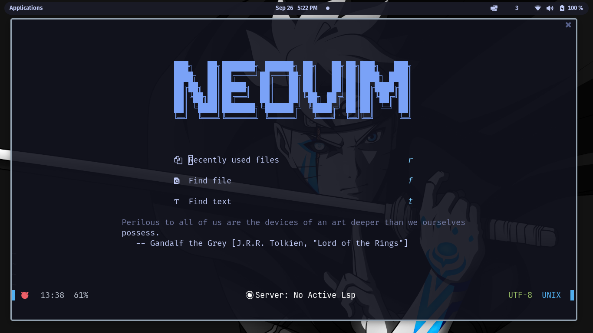

# Neovim Clean

A simple easy to configure Neovim config.


## Features

- Lsp
- Mason
- Telescope
- Variety of colorschemes

## ScreenShots

 


## Installation

 1. Make sure to delete or move your current ~/.config/nvim folder

 2. git clone this command 

```bash
  git clone https://github.com/ShadmanAhm3d/NeovimC ~/.config/nvim
```
3. Enjoy
    
## Acknowledgements

 - [Gigachad Chris](https://github.com/LunarVim/Neovim-from-scratch)
